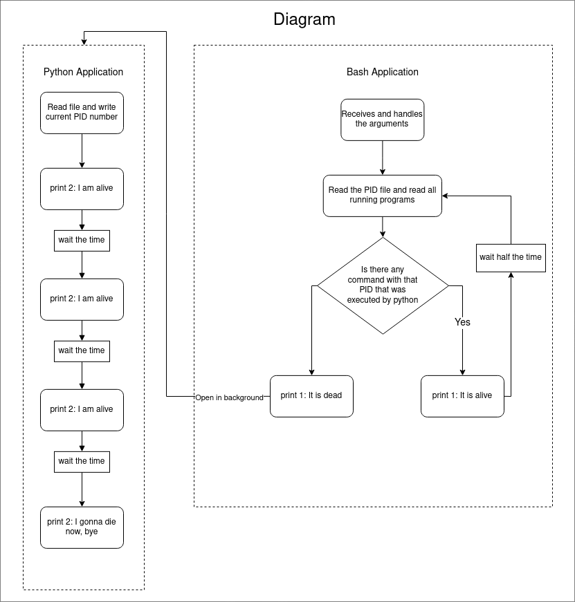

<!-- vscode-markdown-toc -->

- 1. [Descrição das aplicações](#Descriodasaplicaes)
  - 1.1. [Aplicação em Python](#AplicaoemPython)
  - 1.2. [Aplicação em Shell Script](#AplicaoemShellScript)
- 2. [Comandos úteis](#Comandosteis)
  - 2.1. [help](#help)

<!-- vscode-markdown-toc-config
	numbering=true
	autoSave=true
	/vscode-markdown-toc-config -->
<!-- /vscode-markdown-toc --><!-- vscode-markdown-toc -->

---

# 1. <a name='TesteCromai'></a>Teste Cromai ✅

O teste consiste em criar uma aplicação constituída de duas partes. Cada uma dessas mini aplicações foi criada usando uma linguagem diferente: python e shell script. Para entender melhor a natureza do problema, foi criado um diagrama, o qual é apresentado abaixo.



## 1. <a name='Descriodasaplicaes'></a>Descrição das aplicações

### 1.1. <a name='AplicaoemPython'></a>Aplicação em Python

A aplicação consiste em:

1. abrir um arquivo com o nome `pid`. O arquivo deve ser criado caso ele não exista;
2. pegar o pid do programa que está em execução e gravar no arquivo `pid`;
3. rodar um loop com três iterações, e a cada iteração deve mostrar a mensagem `2: I am alive`;
4. por fim deve mostrar a mensagem `2: I gonna die now, bye`.

O código dessa aplicação está no arquivo [app/app.py](./app/app.py).

### 1.2. <a name='AplicaoemShellScript'></a>Aplicação em Shell Script

A aplicação consiste em:

1. rodar em um loop infinito;
2. a cada iteração dele ler um arquivo chamado `pid`
3. verificar se existe um programa em python com esse `pid`;
4. se essa condição for verificada, então o deve mostrar `1: It is alive`;
5. e, se não, deve mostrar a mensagem `1: It is dead` e rodar o programa em python.

O código dessa aplicação está no arquivo [app/app.sh](./app/app.sh).

Temos duas observações importantes a serem expostas:

1. como pode ser observado no diagrama, o programa em shell script executa a aplicação em python em background. Na descrição original não possui essa informação, mas sem essa condição nunca existirá uma aplicação rodando com o mesmo PID que foi salvo no arquivo.
2. A cada iteração o programa espera um tempo antes de ler e ler o arquivo `pid` e realizar a verificação se existe um processo com o PID. Isso pode ser explicado pelo problema de Thead Safe: A aplicação em shell script ler o arquivo antes da aplicação em python salvar. Isso faz com que o processo python seja executado várias vezes, causando bugs.

# 2. <a name='RodandoaAplicao'></a>Rodando a Aplicação

Para facilitar na execução de comandos foi criado um arquivo [Makefile](./Makefile) na raiz no projeto. Como dependência precisamos instalar duas libs: [poetry]() e [make](https://www.gnu.org/software/make/)

O poetry é um gerenciador de dependencias do python. Podemos instala-lo usando o comando:

```
$ pip install poetry
```

Make é uma ferramenta que controla a geração de executáveis e não executáveis através de arquivos fonte do programa. Ele facilita a vida do desenvolver ao passo de que para gerar builds completas ou outros comandos complexos não é necessário possuir conhecimento profundo dos detalhes de implementação. Basta adicionar os comandos em um arquivo `Makefile` e pronto! Para usá-lo podemos instalar o meta pacote [build essential](https://pimylifeup.com/ubuntu-build-essential/) usando o comando abaixo:

```
$ apt install build-essential
```

## 2. <a name='Comandosteis'></a>Comandos úteis

### 2.1. <a name='help'></a>help

Esse comando exibe na tela todos os comandos existentes no arquivo `Makefile`. Para tanto basta rodar o comando a seguir no terminal.

```
$ make help
```

A imagem abaixo mostra a saída do comando `help` no terminal.


### install

Usado para instalar todas as dependencias para produção ou para desenvolvimento.

Para instalar as dependências de desenvolvimento usamos o comando:

```
$ make install-dev
```

Para instalar as dependências de produção usamos o comando:

```
$ make install
```