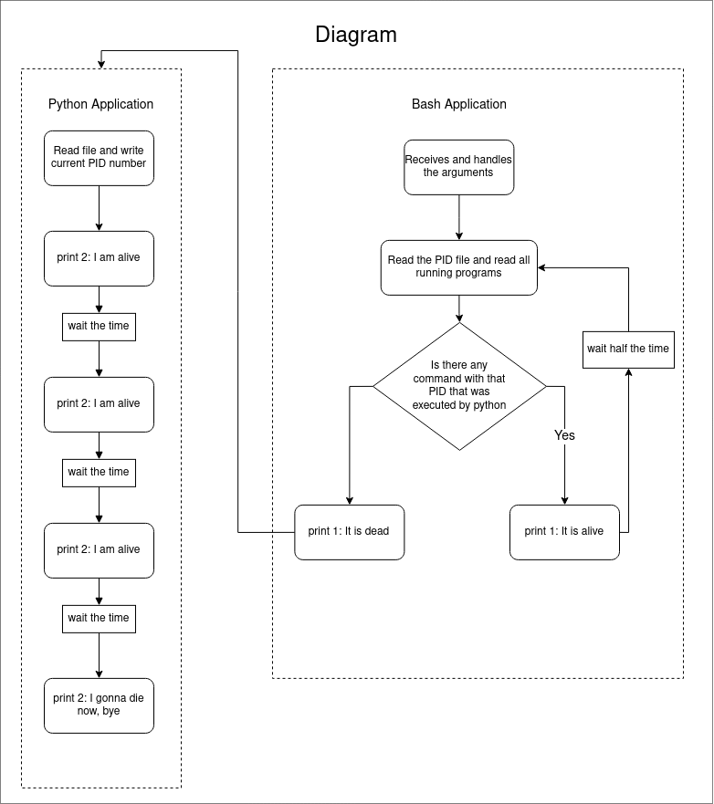

## Teste Cromai  ✅
--- 

O teste consiste em criar uma aplicação constituída de duas partes. Cada uma dessas mini aplicações foi criada usando uma linguagem diferente: python e shell script. Para entender melhor a natureza do problema, foi criado um diagrama, o qual é apresentado abaixo.

### Descrição das aplicações

#### Aplicação em Python

A aplicação consiste em:

1) abrir um arquivo com o nome `pid`. O arquivo deve ser criado caso ele não exista;
2) pegar o pid do programa que está em execução e gravar no arquivo `pid`;
3) rodar um loop com três iterações, e a cada iteração deve mostrar na tela a mensagem `2: I am alive`;
4) por fim deve mostrar na tela a mensagem `2: I gonna die now, bye`.

O código dessa aplicação está no arquivo [app.py](./app/app.py).